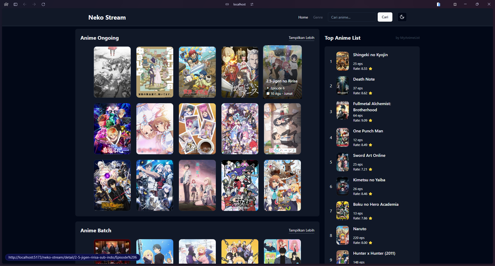
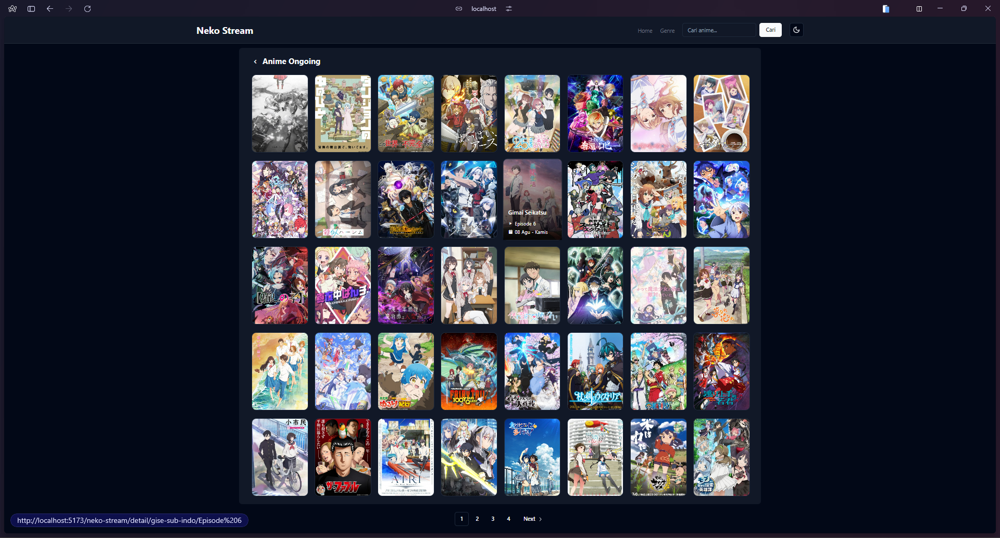
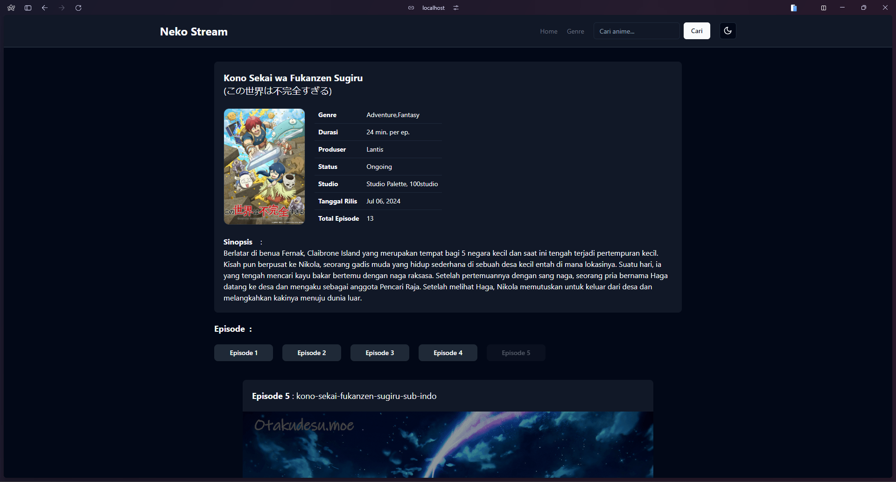
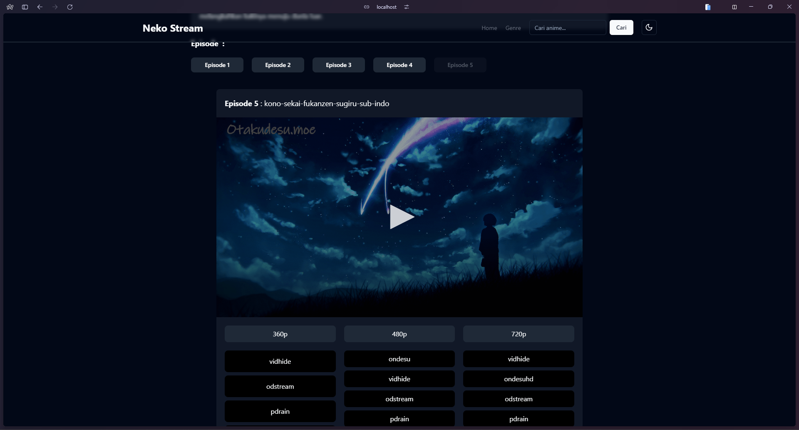
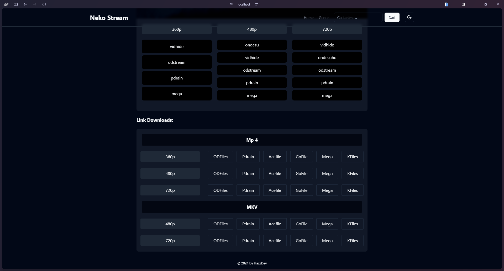

## Getting Started

## Require

Before run the serve, take a look at the following resources:

- [Python v3.12.4+](https://www.python.org/downloads/) - Python.
- [Node v21.6.1+](https://nodejs.org/en) - Node.

library Server:

- Flask
- FlaskCors
- dotEnv #env for flask server

library Scrapping:

- Request
- BeautifulSoup4

Configure FrontEnd:

```bash
yarn install
```

Then configure environment for the frontend

```bash
# run server
flask run

# run FE
yarn dev
```

## DEMO

<div className="grid gap-2 px-5">
    
    
    
    
    
</div>

## NOTE

<strong>I made this website just for fun and has no specific purpose.</strong><br/>Before running
the BE or FE server, make user all library and your .env or venv have done to setup first. enjoy it
^-^.
